# con/serve Implementation Plan

## Context

This project creates a comprehensive knowledge base website cataloging tools and approaches for archiving ALL digital research artifacts into git/git-annex/DataLad repositories. It extends YODA/STAMPED principles beyond code and data to encompass communications (Slack, Telegram), media (YouTube, Zoom), code artifacts (GitHub issues, PRs), AI coding sessions, and infrastructure for self-hosting. The name "con/serve" captures both conservation and serving to AIs/knowledge bases.

The working directory (`/home/yoh/doc/papers.withothers/2026-data-hoarder`) is an existing DataLad dataset (has `.datalad/`, `.git/`, `.noannex`). We will build the Hugo site directly within this repo.

We will share this repository under https://github.com/con/serve and serve website from gh_pages there.

## Architecture Diagram

The homepage will feature this Mermaid diagram showing the bidirectional funnel — ingestion from diverse sources into the git-annex/DataLad vault, and conservation/distribution out to external resources and knowledge bases.

```mermaid
%%{init: {'theme': 'base', 'themeVariables': {'primaryColor': '#2d3748', 'primaryTextColor': '#fff', 'lineColor': '#718096', 'fontSize': '14px'}}}%%

flowchart LR

    %% INBOUND SOURCES
    subgraph IN["INBOUND — Ingestion"]
        direction TB

        subgraph comm["Communications"]
            slack["Slack\n(slackdump)"]
            telegram["Telegram\n(tg-archive)"]
            matrix["Matrix\n(con/versations)"]
            mattermost["Mattermost\n(mmctl export)"]
            email["Email\n(offlineimap)"]
        end

        subgraph media["Media"]
            youtube["YouTube\n(annextube)"]
            zoom["Zoom\nrecordings"]
            podcasts["Podcasts\n(yt-dlp)"]
        end

        subgraph code["Code Artifacts"]
            issues["Issues/PRs\n(git-bug)"]
            discussions["Discussions\n(gh export)"]
            wikis["Wikis\n(gh-md)"]
        end

        subgraph neuro["NeuroImaging"]
            dicom["DICOM / PACS"]
            stimuli["Stimuli\n(ReproStim)"]
            events["Events\n(CurDes BIRCH)"]
            environ["Environment\n(temp/humidity)"]
        end

        subgraph ai["AI Sessions"]
            claude["Claude Code\n(cctrace)"]
            cursor["Cursor\n(SpecStory)"]
            entireio["Entire.io"]
        end

        subgraph pubs["Publications"]
            citations["Citations\n(citations-collector)"]
            pdfs["PDFs\n(Unpaywall)"]
        end
    end

    %% CENTER HUB
    subgraph HUB["THE VAULT"]
        direction TB
        ga["git-annex\ncontent-addressed storage"]
        dl["DataLad\ndataset management"]
        forgejo["Forgejo-aneksajo\nself-hosted"]
        principles["YODA / STAMPED\nprinciples"]

        subgraph harmonize["Data Organization\n& Harmonization"]
            bids["BIDS\n(HeuDiConv/ReproIn)"]
            nwb["NWB"]
            yoda_layout["YODA layout"]
        end

        subgraph surfaces["Working Surfaces"]
            hedgedoc_int["HedgeDoc\n(collaborative docs)"]
            hugo_int["Hugo website\n(con/serve)"]
        end

        subgraph ai_assist["AI Assistance"]
            llm["LLM agents\n(Claude Code, etc.)"]
            skills["Skills & prompts\n(con/serve SKILL)"]
        end

        ga --- dl
        dl --- forgejo
        dl --- principles
        dl --- harmonize
        dl --- surfaces
        ai_assist ---|augment| surfaces
    end

    %% OUTBOUND TARGETS
    subgraph OUT["OUTBOUND — Conservation & Distribution"]
        direction TB

        subgraph cloud_out["Cloud / Storage"]
            gdrive_out["Google Drive"]
            s3_out["S3 / Glacier"]
            dropbox_out["Dropbox"]
        end

        subgraph archives["Domain Archives"]
            openneuro["OpenNeuro"]
            dandi["DANDI"]
            osf["OSF\n(datalad-osf)"]
            ember["EMBER"]
            dlhub["DataLad Hub"]
        end

        subgraph kb["Knowledge Bases"]
            inst_wiki["Institutional\nwikis"]
        end

        subgraph webpub["Web Publishing"]
            ghpages["GitHub Pages"]
        end

        subgraph refmgr["Reference Managers"]
            zotero["Zotero\n(sync)"]
        end
    end

    %% CONNECTIONS: Inbound -> Hub
    comm -->|archive| HUB
    media -->|import| HUB
    code -->|bridge| HUB
    neuro -->|acquire| HUB
    ai -->|capture| HUB
    pubs -->|collect| HUB

    %% CONNECTIONS: Hub -> Outbound
    HUB -->|"special\nremote"| cloud_out
    HUB -->|publish| archives
    HUB -->|export| kb
    HUB -->|deploy| webpub
    HUB -->|sync| refmgr

    %% rclone as bidirectional bridge
    rclone{{"rclone\n(70+ providers)"}}
    rclone <-.->|ingest & backup| HUB
    rclone <-.-> cloud_out

    %% STYLES
    classDef inbound fill:#2b6cb0,stroke:#2c5282,color:#fff,stroke-width:2px
    classDef hub fill:#d69e2e,stroke:#b7791f,color:#1a202c,stroke-width:3px
    classDef outbound fill:#2f855a,stroke:#276749,color:#fff,stroke-width:2px
    classDef bidir fill:#6b46c1,stroke:#553c9a,color:#fff,stroke-width:2px,stroke-dasharray: 5 5
    classDef harmonizeNode fill:#e07b39,stroke:#c05621,color:#fff,stroke-width:2px

    class slack,telegram,matrix,mattermost,email,youtube,zoom,podcasts,issues,discussions,wikis,dicom,stimuli,events,environ,claude,cursor,entireio,citations,pdfs inbound
    class ga,dl,forgejo,principles hub
    class bids,nwb,yoda_layout harmonizeNode
    class hedgedoc_int,hugo_int harmonizeNode
    class llm,skills harmonizeNode
    class gdrive_out,s3_out,dropbox_out,openneuro,dandi,osf,ember,dlhub,inst_wiki,ghpages,zotero outbound
    class rclone bidir

    style IN fill:#ebf8ff,stroke:#2b6cb0,stroke-width:2px,color:#2b6cb0
    style HUB fill:#fefcbf,stroke:#d69e2e,stroke-width:3px,color:#744210
    style OUT fill:#f0fff4,stroke:#2f855a,stroke-width:2px,color:#2f855a

    style comm fill:#bee3f8,stroke:#2b6cb0,color:#2c5282
    style media fill:#bee3f8,stroke:#2b6cb0,color:#2c5282
    style code fill:#bee3f8,stroke:#2b6cb0,color:#2c5282
    style neuro fill:#bee3f8,stroke:#2b6cb0,color:#2c5282
    style ai fill:#bee3f8,stroke:#2b6cb0,color:#2c5282
    style pubs fill:#bee3f8,stroke:#2b6cb0,color:#2c5282
    style harmonize fill:#fbd38d,stroke:#e07b39,stroke-width:2px,color:#744210
    style surfaces fill:#fbd38d,stroke:#e07b39,stroke-width:2px,color:#744210
    style ai_assist fill:#fbd38d,stroke:#e07b39,stroke-width:2px,color:#744210

    style cloud_out fill:#c6f6d5,stroke:#2f855a,color:#276749
    style archives fill:#c6f6d5,stroke:#2f855a,color:#276749
    style kb fill:#c6f6d5,stroke:#2f855a,color:#276749
    style webpub fill:#c6f6d5,stroke:#2f855a,color:#276749
    style refmgr fill:#c6f6d5,stroke:#2f855a,color:#276749
```



**Diagram design notes:**
- **Left-to-right flow**: ingest → vault → distribute, reads naturally as a pipeline
- **Three color zones**: blue (inbound), gold (vault), green (outbound) — instant visual grammar
- **rclone as purple hexagon** with dashed bidirectional arrows — highlights its unique dual role as both ingestion and distribution adapter
- **"THE VAULT"** center contains: git-annex, DataLad, Forgejo-aneksajo, YODA/STAMPED principles, plus two orange subgraphs:
  - **Data Organization & Harmonization** (BIDS/NWB/YODA layout) — shown in the vault to indicate compatibility, NOT developed as part of con/serve itself. These are existing domain-specific standards and tools that *benefit from* the uniformly conserved data resources in the vault. con/serve ensures data is archived in a way that makes harmonization/standardization possible; the actual conversion pipelines (HeuDiConv, ReproIn, etc.) are external projects that operate on vault contents.
  - **Working Surfaces** (HedgeDoc, Hugo website) — internal tools for collaborative authoring and presentation of the archived knowledge. These live *inside* the vault because they are part of the lab's own infrastructure, not external targets.
- **DataLad Hub** moved to Domain Archives (outbound) — it's a publishing target, not core infrastructure
- **NeuroImaging** as domain-specific inbound example: DICOM/PACS, Stimuli (ReproStim), Events (CurDes BIRCH), Environment (temp/humidity) — illustrates how domain extensions feed into the vault
- **Web tools** (ArchiveBox, SingleFile, Browsertrix) remain in content pages but removed from diagram to make room for domain-specific sources
- **Category-level connections** to keep it readable (11 arrows, not 25+)
- Hugo's Congo theme supports Mermaid natively — this will render on the homepage
- Requires Mermaid 10.2+ for subgraph-to-subgraph connections
- **TODO**: Add Mermaid `click` directives to make diagram nodes interactive — each tool node should link to its con/serve page, each external service to its homepage (e.g., `click slack "/tools/communications/slackdump/"`, `click dandi "https://dandiarchive.org/"` etc.)

## Step 1: Install Hugo and Initialize Site

Use `uv` and `uv pip` where feasible for installation of necessary components.

- Install Hugo via pip under uv: `uv venv && source .venv/bin/activate && uv pip install hugo`
- Verify: `hugo version`
- Initialize Hugo site in the current directory (not `hugo new site` which creates a subdirectory - instead manually create the structure since this is an existing git repo)
- Install Congo theme via git submodule (preferred over Hugo modules since this is a DataLad/git-annex repo where submodules are natural):
  ```
  git submodule add -b stable https://github.com/jpanther/congo.git themes/congo
  ```

## Step 2: Configure Hugo with Congo Theme

Create `config/_default/` directory structure with these files:

- **`config/_default/hugo.toml`** - Base config: `theme = "congo"`, baseURL (initially for GitHub Pages), title "con/serve", taxonomies
- **`config/_default/languages.en.toml`** - English language settings, site title/description
- **`config/_default/markup.toml`** - Markdown rendering settings (goldmark, table of contents)
- **`config/_default/menus.en.toml`** - Navigation: Tools, Infrastructure, Concepts, About
- **`config/_default/params.toml`** - Congo parameters: color scheme, homepage layout, article appearance, taxonomy display settings

### Custom Taxonomies

Define in `hugo.toml`:
```toml
[taxonomies]
  category = "categories"        # Communications, Media, Code, AI Sessions, Infrastructure, Web, Cloud Storage, Publications
  tag = "tags"                   # free-form tags
  media_type = "media_types"     # slack, telegram, email, youtube, zoom, github-issues, etc.
  integration = "integrations"   # native-datalad, git-annex, git-only, external
  ai_readiness = "ai_readiness"  # ai-ready, ai-partial, ai-manual
```

## Step 3: Create Content Structure

```
content/
  _index.md                    # Homepage - vision statement, YODA/STAMPED context
  tools/
    _index.md                  # Tools overview page
    communications/
      _index.md                # Section index
      slackdump.md             # rusq/slackdump - Slack archival
      wayslack2.md             # datalad-based Slack archival
      telegram-archive.md      # GeiserX/Telegram-Archive
      tg-archive.md            # knadh/tg-archive
      conversations.md         # con/versations - Matrix room archival (Python, matrix-nio, DataLad-native)
      matrix-archive.md        # matrix-archive (russelldavies) - YAML+media Matrix export
      mattermost-export.md     # Mattermost bulk export (mmctl) + API-based alternatives
    media/
      _index.md
      annextube.md             # con/annextube - YouTube (PROMINENT)
      yt-dlp.md                # Basic yt-dlp + git-annex import
      gallery-dl.md            # Image gallery archival
      zoom-archival.md         # Zoom recording approaches
    code-artifacts/
      _index.md
      git-bug.md               # Distributed bug tracker with bridges
      github-backup.md         # josegonzalez/python-github-backup
      gh-discussions-export.md # GitHub discussions export
      gh-md.md                 # GitHub markdown backup
      datalad-crawler.md       # DataLad web resource crawler
    cloud-storage/
      _index.md
      rclone.md                # rclone - Swiss army knife for cloud storage (Google Drive, S3, etc.)
    publications/
      _index.md
      citations-collector.md   # con/citations-collector - scholarly citation discovery & curation
      zotero.md                # Zotero integration for reference management & export
    web/
      _index.md
      archivebox.md            # ArchiveBox - self-hosted web archiving
      singlefile.md            # SingleFile browser extension
      browsertrix.md           # Browsertrix headless crawler
      httrack.md               # HTTrack website copier
    ai-sessions/
      _index.md                # AI session archival overview
      entire-io.md             # Entire.io - git-native AI session archival
      cctrace.md               # cctrace conversation capture
      specstory.md             # SpecStory - VS Code extension
      claude-code-hooks.md     # Claude Code hooks (PreCompact/Stop/SessionEnd)
      ccexport.md              # ccexport - Claude Code transcript export
  infrastructure/
    _index.md                  # Infrastructure overview
    forgejo-aneksajo.md        # Forgejo fork with git-annex support
    hedgedoc.md                # Collaborative documentation
    pyinfra.md                 # Python infrastructure orchestration
    lab-in-a-box.md            # Full lab deployment (liab-deployments)
    datalad-hub.md             # DataLad Hub hosting service
  concepts/
    _index.md                  # Key concepts overview
    conservation-to-external.md  # Publishing/backing up to external resources
    ingestion-patterns.md      # Common patterns for pulling data into git/annex
    domain-extensions.md       # Extending con/serve for domain-specific workflows
  about/
    _index.md                  # Project vision, STAMPED principles, Frozen Frontiers
    contributing.md            # How to contribute new tool entries
```

### Content Front Matter Template

Each tool page will use this front matter pattern:
```yaml
---
title: "Tool Name"
date: 2026-02-12
description: "One-line description"
summary: "Brief summary for listing pages"
categories: ["Communications"]
tags: ["slack", "export", "json"]
media_types: ["slack"]
integrations: ["git-annex"]
ai_readiness: ["ai-ready"]
params:
  # URLs (required — every tool must have at least repo + homepage)
  repo: "https://github.com/org/repo"           # source code repository (REQUIRED)
  homepage: "https://tool.example.com"           # project homepage or docs (REQUIRED, can be same as repo)
  issues: "https://github.com/org/repo/issues"   # bug tracker / issue tracker (REQUIRED)
  discussions: "https://github.com/org/repo/discussions"  # forum / discussions / Q&A (optional, if available)
  docs: "https://tool.readthedocs.io"            # dedicated documentation site (optional)
  changelog: "https://github.com/org/repo/blob/main/CHANGELOG.md"  # changelog (optional)
  # Metadata
  language: "Go"
  license: "GPL-3.0"
  maturity: "stable"        # stable, beta, alpha, concept
  last_verified: "2026-02"  # when URLs and content were last verified
---
```

**Front matter URL requirements:**
- `repo`, `homepage`, `issues` are **mandatory** for every tool page — ensures users can always find source, docs, and report problems
- `discussions` is included when the project has a forum, GitHub Discussions, mailing list, or Matrix/IRC channel
- `docs` and `changelog` are optional but encouraged
- All URLs will be validated by CI (see Verification section below)

## Step 4: Write Content Pages

### Priority content (write fully):
1. **Homepage** (`_index.md`) - Vision: extending YODA to all digital artifacts, STAMPED framework, "Frozen Frontiers" concept
2. **annextube.md** - Detailed coverage as the flagship YouTube archival tool (from ~/proj/annextube)
3. **entire-io.md** - AI session archival with shadow branches, metadata branch, attribution tracking
4. **forgejo-aneksajo.md** - Self-hosted git-annex hosting, DataLad Hub foundation
5. **lab-in-a-box.md** - pyinfra-based deployment of complete research infrastructure to "con/serve" to
6. **rclone.md** - The Swiss army knife: ingests from 70+ cloud providers (Google Drive, Dropbox, S3, etc.) AND serves as git-annex special remote for backup/publishing to external resources
7. **citations-collector.md** - Scholarly citation discovery across CrossRef/OpenCitations/DataCite/OpenAlex, Zotero sync, PDF acquisition with git-annex provenance

### Standard content (write with key details):
- All other tool pages with description, features, installation, git-annex/DataLad integration notes, AI readiness assessment

### Integration level definitions:
- **native-datalad**: Direct DataLad integration or plugin (annextube, datalad-crawler, wayslack2, citations-collector)
- **git-annex**: Works with git-annex but not DataLad-specific (yt-dlp import, gallery-dl, rclone special remote)
- **git-only**: Stores in git but no annex support (git-bug, gh-md, tg-archive)
- **external**: Requires manual import into git/annex (ArchiveBox, SingleFile, Browsertrix)

### Dual-role tools (ingestion AND distribution):
- **rclone**: Ingests from Google Drive/Dropbox/S3/70+ providers → git-annex. Also serves as git-annex special remote for backup/publishing TO those same providers. This bidirectionality is gold for the con/serve model.
- **git-annex**: Native support for many special remotes (S3, rsync, web, bittorrent, etc.) — see git-annex special remotes documentation
- **DataLad**: Orchestrates both ingestion (`datalad clone`, `datalad download-url`) and publishing (`datalad push`, `datalad create-sibling-*`) — see DataLad Handbook

### New content sections:

**cloud-storage/** - Tools for archiving cloud-hosted files (Google Drive, Dropbox, OneDrive, S3, etc.)
- rclone is the star here: 70+ cloud providers, can mount as filesystem, sync bidirectionally, and critically serves as a git-annex special remote

**publications/** - Conservation of scholarly output and references
- **citations-collector**: Multi-source citation discovery (CrossRef, OpenCitations, DataCite, OpenAlex), Zotero sync, PDF acquisition with git-annex provenance tracking, LinkML schema with CiTO/FaBiO ontology alignment
- **zotero.md**: Zotero as reference management hub — exporting collections, BetterBibTeX integration, group libraries for collaborative curation

**concepts/** - Cross-cutting concepts that span multiple tools
- **conservation-to-external.md**: How to publish/backup from git-annex/DataLad to external resources (S3, cloud storage, Forgejo, GitHub). Points to git-annex special remotes docs and DataLad Handbook chapters on publishing. rclone special remote as universal adapter.
- **ingestion-patterns.md**: Common patterns for pulling data INTO repositories — direct download, API-based, crawler-based, mount-and-copy
- **domain-extensions.md**: How con/serve's generic archival platform can be extended for domain-specific workflows. The core platform handles media-agnostic ingestion, conservation, and distribution. Domain extensions add:
  - Domain-specific data formats and conversion pipelines
  - Domain-specific external archives as publishing targets
  - Domain-specific metadata standards

  **Example: Neuroimaging extension** (illustrative, not exhaustive):
  - Ingestion: DICOMs, behavioral logs, audio/video stimuli (repronim/reprostim)
  - Conversion: BIDS formatting via HeuDiConv/ReproIn
  - Publishing to: OpenNeuro, DANDI, EMBER, or generic platforms like OSF (via datalad-osf)
  - Standards: BIDS, NWB, NIDM

  Other potential domain extensions: genomics (SRA, GEO), environmental science, digital humanities, etc. The platform is deliberately generic — domain extensions define the "last mile" from archived raw artifacts to community standards and archives.

### AI readiness definitions:
- **ai-ready**: Output is structured text/JSON that AIs can directly consume
- **ai-partial**: Output has structured metadata but content may need processing
- **ai-manual**: Output is primarily binary/media requiring transcription for AI use

## Step 5: Preserve Conversation History

Create `artifacts/.gitattributes` to ensure all Claude sessions are git-annex tracked:
```
claude-sessions/** annex.largefiles=anything
```

Then save this session:
- Export the conversation from `~/.claude/projects/-home-yoh-doc-papers-withothers-2026-data-hoarder/30311ca8-d44c-44d6-b2aa-4f47b9dc9d15.jsonl`
- Copy to `artifacts/claude-sessions/2026-02-12-initial-research.jsonl` — git-annex will pick it up automatically via the `.gitattributes` rule
- Add a note in README about using Entire.io for future session preservation
- Note: Entire.io (`entireio/cli`) uses shadow branches and a metadata branch to track AI sessions within git repos - ideal for ongoing con/serve development

## Step 6: Create README.md

Include:
- Project name and tagline: "con/serve - conserve and serve digital research artifacts"
- Vision: YODA principles for everything beyond code and data
- Quick start: how to build/serve locally
- Content structure explanation
- How to add new tool entries

### TODOs section in README:
- [ ] Develop Claude Code SKILL (`/conserve.add-tool`) for adding new tool entries with proper taxonomies
- [ ] Set up GitHub Pages deployment via GitHub Actions
- [ ] Create a sample (fully or partially private) deployment at e.g. conserve.centerforopenneuroscience.org
- [ ] Integrate Entire.io for ongoing AI session archival during development
- [ ] Add comparison matrix page (tool x feature grid)
- [ ] Create archival workflow guides (step-by-step for each media type)
- [ ] Add con/ceptualization#2 vision page (config-driven archival orchestrator)
- [ ] Set up CI to validate content front matter schema
- [ ] Create RSS/Atom feed for new tool additions
- [ ] Explore MkDocs alternative for deeper DataLad ecosystem alignment
- [ ] Add `click` hyperlinks to Mermaid diagram nodes — link to con/serve tool pages and external project homepages

## Step 7: GitHub Pages Setup

Create `.github/workflows/hugo.yml`:
- Trigger on push to main branch
- Install Hugo (extended version)
- Build site with `hugo --minify`
- Deploy to GitHub Pages
- Configure for con/serve repo under GitHub org

## Step 8: Create .gitignore

Add Hugo-specific ignores:
```
public/
resources/_gen/
.hugo_build.lock
```

## Verification / Testing Success Criteria

### Build & Render
1. **Hugo builds without errors**: `hugo` produces output in `public/` with zero errors/warnings
2. **Local preview works**: `hugo server` serves site on localhost, all pages render
3. **Navigation works**: All menu items link to correct sections
4. **Taxonomy pages render**: `/media_types/`, `/integrations/`, `/ai_readiness/` pages list tools correctly
5. **Theme matches TRR379**: Congo theme renders with similar look to pool.trr379.de

### Content Completeness & Schema Validation
6. **Required front matter**: Every tool page has `repo`, `homepage`, and `issues` URLs populated
7. **Taxonomy coverage**: Every tool page has valid `categories`, `integrations`, and `ai_readiness` values
8. **No empty params**: A script/CI check validates that no required front matter fields are blank or placeholder

### External Link Validation
9. **All external URLs resolve**: Use `htmltest` or `lychee` (Rust-based, fast) to crawl the built `public/` directory and verify every external URL returns HTTP 2xx
   - Run: `lychee --verbose public/` (or `htmltest` with `.htmltest.yml` config)
   - CI integration: add to GitHub Actions workflow as a post-build step
   - Config: allow retries for transient failures, set timeout, exclude known-flaky URLs if needed
   - **Every tool page's `repo`, `homepage`, `issues`, `discussions`, `docs` URLs must resolve**
10. **Internal links valid**: Hugo's built-in `--printPathWarnings` flag catches broken internal refs; `lychee` also checks relative links in the built output

### Infrastructure & Deployment
11. **README is complete**: README.md contains vision, quickstart, TODOs
12. **Conversation preserved**: Session transcript is stored in artifacts/
13. **Git status clean**: All files committed via DataLad, submodule tracked properly
14. **GitHub Actions workflow**: Workflow file present and syntactically valid (actual deployment after pushing to GitHub)
15. **Link checker in CI**: `.github/workflows/hugo.yml` includes a `lychee` step that fails the build if any external URL is broken

### Periodic Maintenance
- `last_verified` field in front matter tracks when each tool's URLs were last manually checked
- CI link checker runs on every push AND on a weekly schedule (cron) to catch link rot early
- Broken link reports create GitHub issues automatically (via `lychee` GitHub Action output)

## Files to Create (Summary)

```
config/_default/hugo.toml
config/_default/languages.en.toml
config/_default/markup.toml
config/_default/menus.en.toml
config/_default/params.toml
content/_index.md
content/tools/_index.md
content/tools/communications/_index.md
content/tools/communications/slackdump.md
content/tools/communications/wayslack2.md
content/tools/communications/telegram-archive.md
content/tools/communications/tg-archive.md
content/tools/communications/conversations.md
content/tools/communications/matrix-archive.md
content/tools/communications/mattermost-export.md
content/tools/media/_index.md
content/tools/media/annextube.md
content/tools/media/yt-dlp.md
content/tools/media/gallery-dl.md
content/tools/media/zoom-archival.md
content/tools/code-artifacts/_index.md
content/tools/code-artifacts/git-bug.md
content/tools/code-artifacts/github-backup.md
content/tools/code-artifacts/gh-discussions-export.md
content/tools/code-artifacts/gh-md.md
content/tools/code-artifacts/datalad-crawler.md
content/tools/web/_index.md
content/tools/web/archivebox.md
content/tools/web/singlefile.md
content/tools/web/browsertrix.md
content/tools/web/httrack.md
content/tools/cloud-storage/_index.md
content/tools/cloud-storage/rclone.md
content/tools/publications/_index.md
content/tools/publications/citations-collector.md
content/tools/publications/zotero.md
content/tools/ai-sessions/_index.md
content/tools/ai-sessions/entire-io.md
content/tools/ai-sessions/cctrace.md
content/tools/ai-sessions/specstory.md
content/tools/ai-sessions/claude-code-hooks.md
content/tools/ai-sessions/ccexport.md
content/infrastructure/_index.md
content/infrastructure/forgejo-aneksajo.md
content/infrastructure/hedgedoc.md
content/infrastructure/pyinfra.md
content/infrastructure/lab-in-a-box.md
content/infrastructure/datalad-hub.md
content/concepts/_index.md
content/concepts/conservation-to-external.md
content/concepts/ingestion-patterns.md
content/concepts/domain-extensions.md
content/about/_index.md
content/about/contributing.md
artifacts/.gitattributes                                     (claude-sessions/** annex.largefiles=anything)
artifacts/claude-sessions/2026-02-12-initial-research.jsonl  (git-annex via .gitattributes)
README.md
.github/workflows/hugo.yml
.gitignore (update)
themes/congo  (git submodule)
```

~49 content files + 5 config files + README + workflow + submodule
