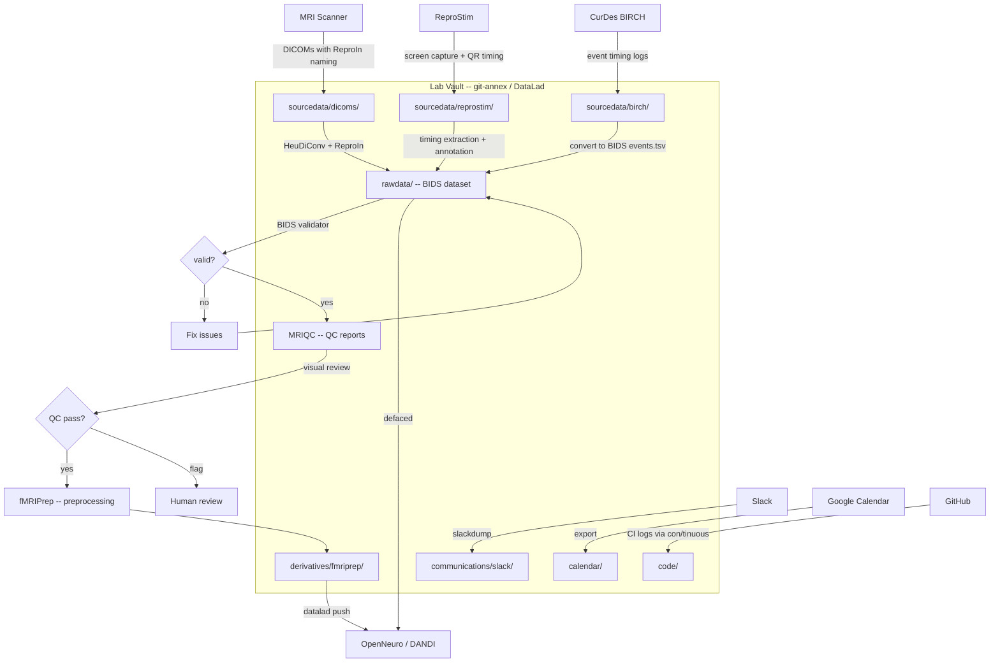

## The Goal

A neuroimaging research lab wants a **unified vault**
that captures everything their experiments produce --
from raw scanner data through processed derivatives --
alongside the communications, code, and scheduling artifacts
that surround the science.

The lab runs MRI experiments, collects behavioral and stimulus data,
communicates over Slack, tracks events in Google Calendar,
and develops processing code on GitHub.
Today these live in disconnected silos:
DICOMs on a PACS server, event files on a lab workstation,
Slack threads in Slack's cloud, code on GitHub,
and processed results scattered across lab members' home directories.

## Data Sources

### MRI Acquisitions (DICOMs)

The primary data stream.
The lab acquires structural and functional MRI data
using the [ReproIn](https://github.com/repronim/reproin) naming convention,
which encodes BIDS-compatible metadata directly in DICOM series descriptions.
This means conversion to [BIDS](/standards/bids/) can be fully automated
via [HeuDiConv](https://github.com/nipy/heudiconv).

| Source | Format | Volume per session | Frequency |
|--------|--------|-------------------|-----------|
| Structural (T1w, T2w) | DICOM | 200-500 MB | Per subject |
| Functional (BOLD) | DICOM | 2-10 GB | Multiple runs per session |
| Field maps | DICOM | 50-200 MB | Per session |
| Diffusion (DWI) | DICOM | 1-5 GB | Optional |

### Stimulus Capture (ReproStim)

[ReproStim](https://github.com/ReproNim/reprostim) captures
the actual audio/video stimuli presented during scanning sessions --
screen recordings with QR-code-embedded timing synchronization.
This is critical for relating brain activity to specific stimulus events.

The captured media lands in git-annex as binary content
and can later be annotated via [Annotation Garden]()
to produce BIDS-compliant events files with HED tags.

### Behavioral Events (CurDes BIRCH)

The CurDes BIRCH response box records
participant button presses, response times, and event timing
during MRI experiments.
These event logs are the behavioral counterpart to the fMRI data --
they document what the participant did and when.

Event files need to be converted to BIDS events format
(`*_events.tsv` with onset, duration, and trial type columns)
and aligned with the functional imaging data timing.

### Slack (Lab Communication)

The lab uses Slack for internal communication:
experiment coordination, data quality discussions,
analysis troubleshooting, paper drafts, and general lab life.

[slackdump]() archives these conversations
into structured JSON with full threading, reactions, and file attachments.

Key channels to archive:

| Channel | Content | Privacy |
|---------|---------|---------|
| `#experiments` | Session scheduling, scanner issues, protocol changes | private |
| `#analysis` | Processing questions, pipeline debugging, results discussion | private |
| `#papers` | Manuscript drafts, reviewer responses, submission coordination | private |
| `#general` | Lab announcements, social coordination | private |

### Google Calendar (Scheduling)

Scanner time slots, lab meetings, deadlines, conference dates.
Available via Google Takeout or CalDAV API export.
Low volume but useful for correlating events
("when did we change the protocol?" maps to a calendar entry).

### GitHub (Code and Project Management)

The lab maintains repositories for:

- **Processing pipelines** -- scripts that orchestrate HeuDiConv, MRIQC, fMRIPrep
- **Analysis code** -- statistical analysis, figures, manuscripts
- **Stimulus code** -- PsychoPy/PsychToolbox experiment scripts
- **Lab wiki/docs** -- protocols, onboarding materials

The code is already in git, but associated artifacts --
issues, pull request discussions, wiki pages, CI logs --
are platform-hosted and at risk of loss.
[con/tinuous]() archives CI logs,
[git-bug]() bridges issues into git,
and [python-github-backup]()
captures the full repository metadata.

The lab's [Forgejo-Aneksajo]() instance
(deployed via [Lab-in-a-Box]())
can mirror GitHub repositories and use GitHub as an OAuth2 authentication source,
so lab members log in with their existing GitHub accounts.
See the [Software Project]() story
for a deeper treatment of GitHub organization archival.

## Processing Pipeline

Once data enters the vault, the processing pipeline runs:

```
DICOMs (ReproIn convention)
    → HeuDiConv + ReproIn heuristic → BIDS dataset
        → BIDS validator → pass/fail gate
            → MRIQC → QC reports (visual review)
                → fMRIPrep → preprocessed derivatives
```

Each step is wrapped in `datalad run`
(via [datalad-container]()
for containerized BIDS Apps)
so the full processing provenance is recorded.
[con/duct](https://github.com/con/duct) captures resource telemetry
(memory, CPU, wall time) for each step.

### BIDS Apps

| App | Purpose | Container |
|-----|---------|-----------|
| [MRIQC](https://mriqc.readthedocs.io/) | Image quality metrics and visual reports | Singularity via datalad-container |
| [fMRIPrep](https://fmriprep.org/) | Standardized fMRI preprocessing (motion correction, registration, confound estimation) | Singularity via datalad-container |

These are run as containerized BIDS Apps
registered in the dataset via `datalad containers-add`,
following the [ReproNim/containers](https://github.com/ReproNim/containers)
collection pattern.

## Vault Organization

```
lab-vault/                               # DataLad superdataset
    ├── sourcedata/
    │   ├── dicoms/                      # Raw DICOMs (ReproIn naming)
    │   │   ├── sub-01/ses-01/
    │   │   └── ...
    │   ├── reprostim/                   # Stimulus capture recordings
    │   ├── birch/                       # Behavioral event logs
    │   └── physio/                      # Physiological recordings (if any)
    ├── rawdata/                         # BIDS-converted dataset
    │   ├── dataset_description.json
    │   ├── participants.tsv
    │   ├── sub-01/
    │   │   ├── anat/
    │   │   ├── func/
    │   │   └── fmap/
    │   └── ...
    ├── derivatives/
    │   ├── mriqc/                       # QC reports
    │   └── fmriprep/                    # Preprocessed data
    ├── code/                            # Processing scripts, heuristics
    │   ├── heudiconv-heuristic.py
    │   └── processing-pipeline.sh
    ├── communications/
    │   └── slack/                       # Archived Slack channels
    ├── calendar/                        # Exported Google Calendar events
    ├── docs/                            # Lab protocols, SOPs
    └── .datalad/
```

Each major component (rawdata, each derivative, communications)
is a nested DataLad subdataset,
following [YODA principles]().

## Distribution and Privacy

| Content | Distribution | Rationale |
|---------|-------------|-----------|
| BIDS rawdata (defaced) | OpenNeuro / DANDI | Public sharing after defacing |
| Derivatives | OpenNeuro (as derivative dataset) | Public, no PII |
| Raw DICOMs | Private (encrypted backup only) | Contains facial features, PHI |
| Slack archives | Private (lab remote only) | Confidential communications |
| Calendar | Private | Lab scheduling details |
| Code | GitHub (public or private per repo) | Already public in most cases |
| ReproStim recordings | Private or restricted | May contain faces, voices |
| BIRCH event logs | Public (with BIDS dataset) | No PII in button presses |

Use git-annex `wanted` expressions with `distribution-restrictions` metadata
to enforce these policies automatically.
See [Privacy and Access Control]().

## Workflow Overview



## Relevant Tools

| Component | Tool | Status |
|-----------|------|--------|
| DICOM to BIDS conversion | [HeuDiConv](https://github.com/nipy/heudiconv) + [ReproIn](https://github.com/repronim/reproin) | Mature, production-ready |
| Stimulus capture | [ReproStim](https://github.com/ReproNim/reprostim) | Active development |
| Stimulus annotation | [Annotation Garden]() | Alpha |
| Quality control | [MRIQC](https://mriqc.readthedocs.io/) | Mature |
| Preprocessing | [fMRIPrep](https://fmriprep.org/) | Mature |
| Container management | [datalad-container]() | Stable |
| Resource telemetry | [con/duct](https://github.com/con/duct) | Stable |
| Slack archival | [slackdump]() | Working |
| CI log archival | [con/tinuous]() | Stable |
| Issue archival | [git-bug]() | Stable |
| Repository backup | [python-github-backup]() | Stable |
| Self-hosted forge | [Forgejo-Aneksajo]() | Beta |
| Deployment | [Lab-in-a-Box]() | Alpha |

## See Also

- [Domain Extensions: Neuroimaging]() --
  the neuroimaging domain extension that this story exercises
- [Automation and Pipelines]() --
  orchestration patterns for the DICOM-to-derivatives pipeline
- [Experience Ledger]() --
  capturing processing failures and resource baselines
- [Brain Imaging Center]() --
  the complementary story from the facility's perspective
- [Software Project]() --
  deeper treatment of GitHub organization archival and Forgejo mirroring
