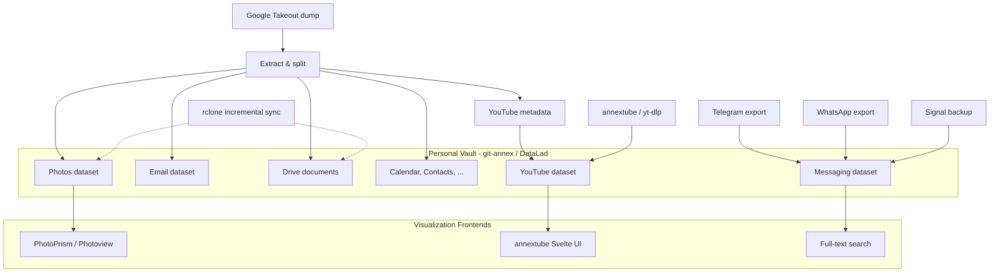

## The Goal

A single person wants to build a **comprehensive personal digital archive**
that captures their digital life across platforms and services,
stored in git-annex repositories they control,
with browsable frontends for day-to-day access.

This is the "data hoarder" use case in its purest form:
not a research lab, not an institution --
just one person who wants to own their data.

## Data Sources

### Google Account (via Google Takeout)

[Google Takeout]() is the single largest ingestion event.
A typical personal Google account export includes:

| Source | What | Volume |
|--------|------|--------|
| **Gmail** | Years of email, attachments | 5-50 GB |
| **Google Photos** | Every photo/video from phone backups | 20-200+ GB |
| **Google Drive** | Documents, spreadsheets, presentations | 1-50 GB |
| **YouTube** | Watch history, liked videos, playlists, subscriptions | Metadata only (small) |
| **Calendar** | Events spanning years | Small |
| **Contacts** | Address book | Small |
| **Location History** | GPS tracks, place visits | Moderate |
| **Chrome** | Bookmarks, browsing history | Small |
| **Google Maps** | Saved places, reviews, starred locations | Small |
| **Keep** | Notes, lists, voice memos | Small |
| **Google Fit** | Activity and health data | Moderate |
| **Hangouts/Chat** | Messaging history | Moderate |

**Status:** [Google Takeout]() documents the ingestion workflow.
The main gap is **automated splitting and metadata reassembly** --
a connector that takes a raw Takeout dump and produces
well-organized domain-specific datasets.

### Photos

Photos are often the most emotionally valuable part of a personal archive
and the most voluminous.
Sources include:

- **Google Photos** (from Takeout) -- the primary source for anyone with an Android phone
- **Apple Photos** (via iCloud export or direct DCIM copy)
- **Camera imports** -- SD cards, USB transfers
- **Messaging apps** -- photos shared in WhatsApp, Telegram, Signal
- **Social media** -- photos posted to Instagram, Facebook (via their export tools)

**Desired end state:**

```
~/vault/personal/photos/
    ├── import-google-2026-02/    # Takeout dump, metadata reassembled
    ├── import-camera-2025/       # Direct camera imports
    ├── albums/                   # Curated albums (links or metadata)
    ├── photos.tsv                # Hierarchical summary index
    └── .datalad/
```

With browsable frontends:

- [PhotoPrism]() for AI-assisted browsing (face recognition, map view, auto-classification)
- [Photoview]() for lightweight filesystem-native gallery (deployed in LiaB)
- [copyparty]() for zero-setup quick browsing and sharing

### Personal Messaging

| Platform | Tool | Format | Notes |
|----------|------|--------|-------|
| **Telegram** (personal channels, groups, DMs) | [tg-archive]() | HTML + JSON | Personal channels are an increasingly common "microblog" |
| **WhatsApp** | Export from app settings | Text + media | Manual process, no good automated tool |
| **Signal** | Signal backup decoder | SQLite | Encrypted backup requires passphrase |
| **Slack** (personal workspaces) | [slackdump]() | JSON | For personal or small-team workspaces |
| **Matrix** (personal rooms) | [matrix-archive]() | HTML/JSON | Self-hosted servers simplify this |
| **Discord** | DiscordChatExporter | HTML/JSON | Personal servers and DMs |

**Desired end state:**

```
~/vault/personal/messaging/
    ├── telegram/
    │   ├── channels/        # Personal channels (microblog-style)
    │   ├── groups/          # Group chats
    │   └── dms/             # Direct messages
    ├── whatsapp/
    ├── signal/
    └── .datalad/
```

### YouTube (Personal Collection)

A personal YouTube presence includes:

- **Watch history** -- years of viewing data
- **Liked videos** -- curated collection of valuable content
- **Playlists** -- organized collections (educational, music, etc.)
- **Subscriptions** -- channels you follow
- **Own uploads** (if any) -- personal content you've published

Metadata comes from [Google Takeout]().
Actual video archival for liked/playlist videos uses
[annextube]() or [yt-dlp]().

**Desired end state:**

```
~/vault/personal/youtube/
    ├── watch-history/
    │   └── history.json         # From Takeout
    ├── liked-videos/
    │   └── videos.tsv           # Index of liked videos
    ├── playlists/
    │   ├── playlists.tsv        # All playlists
    │   └── {playlist-name}/
    │       ├── videos.tsv
    │       └── {video_id}/
    │           ├── metadata.json
    │           └── video.mkv    # git-annex
    ├── subscriptions/
    │   └── subscriptions.json   # From Takeout
    └── .datalad/
```

### Other Personal Data

| Source | Description | Tool |
|--------|-------------|------|
| **Personal website/blog** | Self-hosted content | [httrack]() or direct git archive |
| **Social media** | Facebook, Twitter/X, LinkedIn exports | Platform export tools, [gallery-dl]() for media |
| **Browser bookmarks** | Cross-browser bookmark collection | From Takeout + browser exports |
| **Password manager export** | Credential metadata (NOT passwords in git!) | Manual, encrypted |
| **Health/fitness data** | Strava, Garmin, Apple Health | Platform APIs + export tools |
| **Financial records** | Bank statements, receipts | Manual import, git-annex |
| **Music library** | Purchased music, playlists | Direct file archive |

## Vault Organization

The personal archive as a DataLad superdataset:

```
~/vault/personal/                      # DataLad superdataset
    ├── google-takeout-raw/            # Raw Takeout dump (archival reference)
    ├── photos/                        # Canonical photo collection
    ├── email/                         # Gmail MBOX → processed email
    ├── messaging/                     # All messaging platforms
    ├── youtube/                       # Video collection + metadata
    ├── drive/                         # Google Drive documents
    ├── calendar/                      # Calendar events
    ├── contacts/                      # Address book
    ├── location-history/              # GPS tracks
    ├── web-archives/                  # Saved web pages
    ├── music/                         # Music library
    └── .datalad/
```

Each subdirectory is a nested DataLad dataset,
following [YODA principles]().
This allows independent version tracking, selective replication,
and fine-grained access control via git-annex `wanted` expressions.

## Workflow Overview



## Relevant Tools

| Component | Tool | Status |
|-----------|------|--------|
| Google Takeout download | [Google Takeout]() | Manual, no full automation yet |
| Photo browsing | [PhotoPrism](), [Photoview](), [copyparty]() | Deployable |
| Telegram archival | [tg-archive]() | Working |
| YouTube video archival | [annextube](), [yt-dlp]() | Working |
| Cloud sync | [rclone]() | Working |
| Image gallery archival | [gallery-dl]() | Working |
| Infrastructure deployment | [Lab-in-a-Box]() | Alpha |

## Distribution and Privacy

A personal archive contains some of the most sensitive data imaginable:
location history, private messages, financial records, health data, and photos.

The [privacy and access control]()
principles apply with maximum force here:

- **Archive aggressively** -- your personal data is yours, and platforms can lose or restrict it at any time
- **Distribute selectively** -- use git-annex `wanted` expressions to ensure private content never reaches public remotes
- **Encrypt at rest** -- use git-annex encryption for any remote storage (S3, Backblaze, etc.)
- **Separate personal from professional** -- the personal vault should be a separate superdataset from any institutional or lab archives, with independent access control

```bash
# Example: ensure private content never reaches a public remote
git annex wanted public-remote "include=*.md or include=*.tsv"
git annex wanted encrypted-backup "anything"
git annex wanted here "anything"
```

## See Also

- [Vault Organization]() --
  directory layout approaches for heterogeneous archives
- [Privacy and Access Control]() --
  the principles behind selective distribution
- [Ingestion Patterns]() --
  the paradigms used for different data sources
